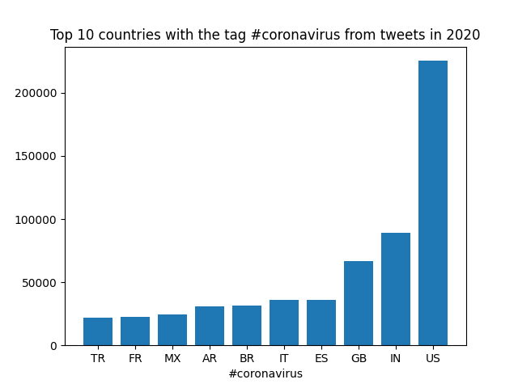
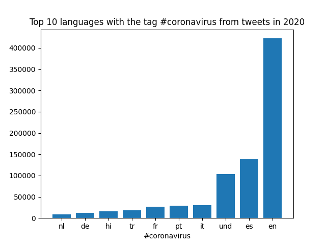
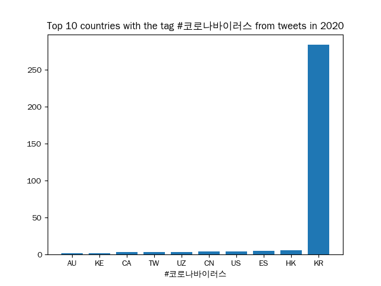
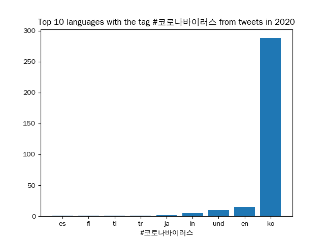

## Coronavirus Twitter Analysis

This project analyzes geotagged tweets from 2020 to track the spread of coronavirus discussions on social media. By utilizing the MapReduce framework, it processes large-scale multilingual text data efficiently, extracting data on hashtag usage by language and country and present them as graphs.

### Data Source

The dataset consists of all geotagged tweets from 2020, stored in daily zip files. Each tweet is formatted in JSON and contains information such as language, hashtags, and location data.

### Usage

All scripts are placed under the `src` folder.  `-h`  flag is available for detailed usage instructions.

`map.py` extracts language and country-specific hashtag counts from tweets using MapReduce. `reduce.py`  aggregates mapped data across multiple days. `visualize.py`  generates bar graphs to display top language or country for each hashtag from aggregated data. Following are some example plots:

    
    
    
    

`alternative_reduce.py` produces time series plots for given hashtag trends over the year according to mapped data.

